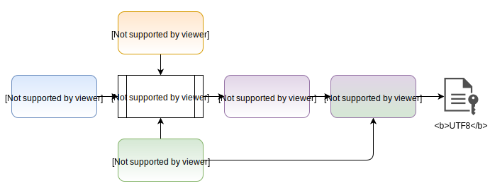
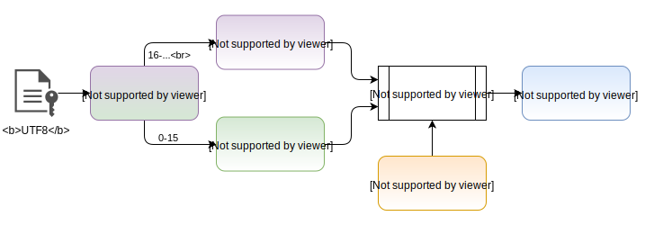

# First-time generated IV then file-persisted use

The example goes through the following steps:
1. `require` all the necessary modules:
   -  `crypto`, the test subject;
   -  `fs`, read and write simple text files;
   -  `path`, resolve file paths;
   -  `assert`, test the result of the operations;
2. setup some utility objects and the cryptography-related functions, including a key that goes through SHA256 (AES-256 requires 256 bits of key (32 Bytes));
   **Note**: Differently from example1, the encrypt function now *appends* the encrypted content after the IV buffer (which is not encrypted in any way).
3. if the encrypted file is missing, a generation function creates it with following rules:

   -  a 16 bytes long IV is created using the `crypto` module's `randomBytes` function
   -  the encrypted content is written to disk as a utf8 encoded hex string.  
   `HEX(*plain text* IV + *encrypted* content)`
   
4. read _synchronously_ the encrypted text file from disk and store it in memory (utf8 encoding);
5. from the read encrypted file extract the first 16 bytes since they are the IV used during the encryption process;
6. from the read encrypted file extract everything past the first 16 bytes as it is the actual encrypted content;
7. decrypt the encrypted content using the extracted IV and the provided secret (**fixed**);
   
8. simple test using Node's integrated assert function (match between plain text and decrypted content).

# Warnings

There are in a few occasions unnecessary convertions from `Buffer` instances to `string` instances. They are there for convenience purposes (debug) since the  `crypto` module's functions transform strings into buffers internally anyway.
